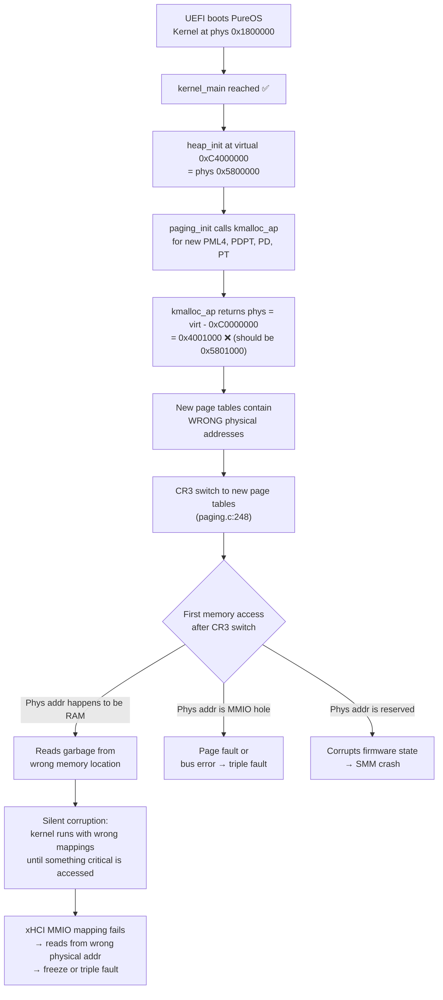

# PureOS vs Linux: Real Hardware Boot Gap Analysis

> **Target Hardware**: Lenovo LOQ (Intel, 8+ GB RAM, xHCI USB 3.0, UEFI)
> **Symptom**: PureOS boots fine in QEMU but crashes/freezes on the real Lenovo LOQ.
> **Serial Log**: [uefi_serial.log](file:///d:/1os-copy/backup/1os/uefi_serial.log) — captured from QEMU (real LOQ has no serial port, so crashes are silent)

---

## Executive Summary — Ranked Crash Causes

| Rank | Subsystem | Severity | Issue |
|------|-----------|----------|-------|
| **🔴 1** | **`kmalloc_ap` physical address calculation** | **CRITICAL** | Hardcoded `- 0xC0000000` assumes kernel phys base = 0, but bootloader places kernel at 0x1800000+. Every page table allocation gets a **wrong physical address**. |
| **🔴 2** | **Paging: blind 1GB identity map** | **CRITICAL** | Maps all of 0–1GB as writable RAM including MMIO holes, ACPI regions, and reserved firmware memory. Writes to these regions corrupt firmware state. |
| **🔴 3** | **No PAT/cache control on MMIO** | **HIGH** | xHCI MMIO mapped without Write-Combining or Uncacheable attributes at the page table level. Cached MMIO reads return stale data; posted writes reorder. |
| **🟠 4** | **xHCI dynamic mapping at 0x200000000** | **HIGH** | Mapping works in QEMU but relies on the paging walker using `kmalloc_ap` (broken, see #1). The new PML4/PDPT/PD entries may point at wrong physical frames. |
| **🟠 5** | **PCI: Bus 0 only scan** | **MEDIUM** | Lenovo LOQ routes xHCI to Bus 0, but NVMe, GPU, and other bridges live on higher buses. Missing devices = missing MMIO reservations. |
| **🟡 6** | **ACPI: missing `_OSC`, `_REG`, `_INI`** | **MEDIUM** | `_OSC` fails with `AE_NOT_FOUND`. Linux evaluates dozens of ACPI methods that configure SMM behavior; PureOS skips them. |
| **🟡 7** | **Interrupt controller: IOAPIC + stale PIC** | **LOW-MED** | IOAPIC routes look correct but `pic_init()` runs before `lapic_init()` — window for stale PIC interrupts hitting wrong handlers. |
| **⚪ 8** | **ExitBootServices handling** | **LOW** | Retry loop is correct. Memory map buffer forced below 1GB. This is fine. |

---

## 1. UEFI Boot → Kernel Handoff

### What Linux Does

Linux's EFI stub (`drivers/firmware/efi/libstub/x86-stub.c`) performs:

1. **`ExitBootServices()` with retry** — gets memory map, calls EBS, if stale key → re-get map and retry (exactly like PureOS).
2. **Preserves UEFI memory map** in a `struct efi_boot_memmap` for later use by the kernel's memory manager.
3. **Does NOT load a new GDT before jumping to the kernel** — the kernel's `startup_64` in `head_64.S` loads its own GDT/IDT from the decompressed image.
4. **Sets up a trampoline identity map** that covers both the EFI stub code AND the kernel entry point, so the CR3 switch is safe.
5. **Calls `efi_relocate_kernel()`** if the kernel is not loaded at the expected physical address — it adjusts all relocations.

### What PureOS Does

[boot.c](file:///d:/1os-copy/backup/1os/src/boot/uefi/boot.c):

1. **`ExitBootServices()` retry** (lines 642–655) ✅ Correct — retries up to 4 times with fresh map key.
2. **Memory map buffer** allocated at fixed low addresses (lines 562–581) ✅ Good — ensures it's below 1GB.
3. **Loads GDT immediately after EBS** (line 660) ✅ Correct — the GDT array is in the .data of BOOTX64.EFI.
4. **Sets segment registers** (lines 663–670) ✅ Correct.
5. **Switches CR3 and jumps** (lines 675–679) ⚠️ Risky but works because `MapImageRegion()` maps the bootloader's own code.

### Gaps

| Area | PureOS | Linux | Risk |
|------|--------|-------|------|
| **IDT after EBS** | No IDT loaded — any exception → triple fault | Linux loads IDT in `startup_64` before enabling interrupts | 🟡 Low — interrupts are CLI'd |
| **Kernel relocation** | Kernel loaded at first available `0x100000 + i*0x200000` slot; if that's not 0x100000, the higher-half mapping compensates | Linux's `efi_relocate_kernel()` handles this properly with relocation fixups | 🟢 OK for PureOS |
| **Stack after CR3 switch** | Jumps to `kernelAddr` which is `pure_kernel.asm` entry — sets its own stack immediately | Linux `startup_64` sets stack from linker-defined symbol | 🟢 OK |

> [!NOTE]
> The UEFI boot → kernel handoff is **not the crash point**. The serial log shows `[K1] KERNEL MAIN REACHED` which means the jump succeeded.

---

## 2. Early Memory / Paging — 🔴 CRITICAL BUGS

### 2A. The `kmalloc_ap` Physical Address Bug

[heap.c:246–263](file:///d:/1os-copy/backup/1os/src/kernel/heap.c#L246-L263):

```c
void *kmalloc_ap(size_t size, uint32_t *phys) {
    void *ptr = kmalloc(size + 4096);
    uint32_t addr = (uint32_t)(uintptr_t)ptr;
    uint32_t aligned = (addr + 0xFFF) & ~0xFFF;
    if (phys) {
        *phys = aligned - 0xC0000000;  // ⚠️ HARDCODED OFFSET
    }
    return (void *)(uintptr_t)aligned;
}
```

**The problem**: This assumes the kernel's virtual base `0xC0000000` maps to physical address `0x0`. But the bootloader maps `0xC0000000 → kernel_phys_base`, and `kernel_phys_base` is determined at boot time. The serial log shows:

```
PAGING: Bootloader kernel phys base = 0x1800000
```

The heap starts at virtual `0xC0000000 + 0x4000000 = 0xC4000000`. Under the bootloader's mapping, this virtual address maps to physical `0x1800000 + 0x4000000 = 0x5800000`. But `kmalloc_ap` calculates:

```
phys = 0xC4001000 - 0xC0000000 = 0x4001000  ← WRONG (should be 0x5801000)
```

**Every page table structure allocated by `kmalloc_ap` gets the wrong physical address written into its parent's entry.** On QEMU with small RAM, the kernel often lands at `0x100000` so `kernel_phys_base = 0` and the bug is hidden. On real hardware with 8+ GB RAM, the kernel lands elsewhere and every `CR3`, `PDE`, `PDPTE`, and `PTE` points at the wrong physical frame.

**What Linux does**: Linux's `__pa()` / `__va()` macros use a compile-time or boot-time offset (`phys_base`) that is set correctly by `startup_64`. The offset is never hardcoded.

### 2B. The "Blind 1GB Identity Map" Problem

[paging.c:87–98](file:///d:/1os-copy/backup/1os/src/kernel/hal/paging.c#L87-L98):

```c
for (uint64_t i = 0; i < 0x40000000; i += 0x1000) {
    page_t *page = get_page(i, 1, kernel_pml4);
    page->present = 1;
    page->rw = 1;
    page->frame = i >> 12;
}
```

This maps **all** of 0–1GB as present+writable, regardless of what the UEFI memory map says. On the Lenovo LOQ, the first 1GB contains:

- **MMIO holes** (e.g., PCIe config space, HPET, TPM MMIO)
- **ACPI NVS** (firmware-owned, must not be overwritten)
- **ACPI Reclaim** (tables the kernel reads)
- **Reserved** regions (SMM, firmware runtime)
- **EfiRuntimeServicesCode/Data** (used by UEFI runtime)

Mapping all of these as normal writable RAM means:
1. **The CPU may cache MMIO reads** (PCD/PWT bits are 0 = Write-Back caching)
2. **Speculative writes to reserved regions** corrupt firmware state
3. **ACPI NVS corruption** can cause SMM handlers to crash

**What Linux does**: Linux's `init_mem_mapping()` consults the E820/UEFI memory map and only maps `EfiConventionalMemory` regions as WB-cacheable. MMIO regions get mapped with `PAGE_KERNEL_IO` (PCD=1, PWT=1). Reserved/NVS/RuntimeServices regions are mapped with appropriate attributes or not mapped at all until needed.

### 2C. No PAT (Page Attribute Table) Configuration

PureOS never programs the PAT MSR and never sets PCD/PWT/PAT bits on MMIO mappings (except the xHCI mapping which sets `pcd = 1`). This means:

- **Framebuffer** at 0xE0000000: mapped as Write-Back (should be Write-Combining for performance)
- **LAPIC** at 0xFEE00000: mapped as Write-Back (must be Uncacheable — Intel SDM Vol 3A §11.4.1)
- **IOAPIC** at 0xFEC00000: same problem

**What Linux does**: Linux initializes PAT early in `pat_init()` and uses `ioremap_nocache()` / `ioremap_wc()` to set correct cache attributes per MMIO region.

### 2D. 4KB Page Walk vs 2MB Huge Pages

The bootloader uses **2MB huge pages** for the initial mapping, but `paging_init()` rebuilds everything with **4KB pages**. This is functionally correct but creates a brief window during the CR3 switch where TLB entries for 2MB pages coexist with 4KB page table structures. On Intel CPUs with PCID disabled, this can cause TLB inconsistencies if an interrupt fires during the transition.

---

## 3. PCI Enumeration

### What PureOS Does

[pci.c:424–454](file:///d:/1os-copy/backup/1os/src/drivers/pci.c#L424-L454):

```c
void pci_init() {
    for (uint16_t bus = 0; bus < 1; bus++) {      // ⚠️ BUS 0 ONLY
        for (uint8_t device = 0; device < 32; device++) {
```

- Uses **legacy I/O port 0xCF8/0xCFC** (Configuration Mechanism 1) — fine for Bus 0 devices
- **Scans only Bus 0** — misses devices behind PCI-to-PCI bridges
- Does not parse the MCFG table for PCIe Enhanced Configuration Access Mechanism (ECAM)
- No BAR size detection (no write-all-1s + readback)

### What Linux Does

1. Parses **MCFG** ACPI table to find ECAM base address for PCIe MMIO config
2. Enumerates all 256 buses recursively, following PCI-to-PCI bridges
3. Performs BAR sizing (write 0xFFFFFFFF, read back, restore original) to determine BAR size
4. Assigns resources from firmware-provided _CRS ranges

### Impact on Real Hardware

The Lenovo LOQ has xHCI on Bus 0 (confirmed by serial log: `B0 D4 F0`), so the Bus-0-only scan **does find it**. However:

- The NVMe controller is likely behind a PCIe bridge on a higher bus → not found → no storage
- Missing bridge enumeration means MMIO windows for downstream devices are unknown
- The AHCI and NVMe drivers show `[SKIPPED]` in the PCI scan, which is correct for safe mode

> [!IMPORTANT]
> Bus-0-only scan is **not the crash cause** (xHCI is found), but it prevents NVMe/AHCI storage from ever working on real hardware.

---

## 4. xHCI Ownership — The Most Visible Crash Point

### The Full Linux xHCI Takeover Sequence

Linux's `xhci_pci_probe()` → `usb_hcd_pci_probe()` → `xhci_pci_setup()`:

1. **`quirk_usb_handoff_xhci()`** (in `drivers/usb/host/pci-quirks.c`):
   - Read HCCPARAMS1 → find Extended Capabilities pointer
   - Walk ext cap list looking for USBLEGSUP (Cap ID = 1)
   - Set HC OS Owned Semaphore (bit 24)
   - Wait up to 1 second for BIOS to clear bit 16
   - **Clear USBLEGCTLSTS** (SMI sources) — disable all SMI generation
   - If BIOS doesn't release → force clear bit 16, set bit 24

2. **Enable Bus Mastering** — set PCI Command register bits 1+2

3. **`xhci_reset()`**:
   - Write USBCMD.HCRST = 1
   - Wait for CNR (Controller Not Ready) to clear
   - Wait for USBCMD.HCRST to self-clear

4. **Set USBCMD.RS = 0** (stop), wait for HCHalted
5. **Program DCBAA, Command Ring, Event Ring**
6. **Configure MSI/MSI-X** (NOT pin interrupts)
7. **Set USBCMD.RS = 1** (run)

### What PureOS Does

[pci.c:318–401](file:///d:/1os-copy/backup/1os/src/drivers/pci.c#L318-L401) + [xhci.rs:118–](file:///d:/1os-copy/backup/1os/rust/src/xhci.rs#L118):

```
Flow: BAR read → dynamic MMIO mapping → _OSC eval → Bus Master enable →
      USBLEGSUP handoff → rust_xhci_init() → halt → reset → start → enumerate
```

### Gaps

| Step | Linux | PureOS | Risk |
|------|-------|--------|------|
| **BAR reading** | Reads BAR0+BAR1 for 64-bit, masks type bits | ✅ Same — correctly handles 64-bit BAR | 🟢 OK |
| **MMIO mapping** | `ioremap_nocache()` with proper PTE attributes | Maps to 0x200000000 using `get_page()` + `pcd=1` — but `get_page` calls `kmalloc_ap` which has **broken phys addr calc** (see §2A) | 🔴 CRITICAL |
| **_OSC evaluation** | Full `acpi_pci_osc_control_set()` with query phase first | Single call, fails with `AE_NOT_FOUND` (no `\_SB.PCI0` on QEMU; real LOQ does have it) | 🟡 Medium |
| **Bus Mastering** | Standard PCI command register update | ✅ Correct — sets bits 1+2, disables INTx (bit 10) | 🟢 OK |
| **USBLEGSUP handoff** | Full handoff with SMI disable | ✅ Correct implementation with timeout and force | 🟢 OK |
| **Interrupt mode** | MSI-X (never uses legacy pin interrupts) | Uses **timer-tick polling at 250 Hz** with INTx disabled | 🟡 Works but misses events between ticks |
| **HCCPARAMS1 read** | From properly mapped MMIO | From `cap_base[0x10 / 4]` — this reads **offset 0x10 from MMIO base**, which is HCCPARAMS1 ✅ | 🟢 OK |

### The Real Crash Scenario

The xHCI MMIO mapping at `0x200000000` uses `get_page(virt, 1, kernel_pml4)` which internally calls `kmalloc_ap` to allocate new page table levels (PML4[4], PDPT, PD, PT entries for the 8GB range). Because of the `kmalloc_ap` bug (§2A), these page table entries contain **wrong physical addresses**. When the CPU walks the page table to translate `0x200000000`, it reads garbage from the wrong physical frame, and:

- If the garbage happens to have Present=0 → **#PF (page fault)**
- If the garbage points at some random RAM → MMIO reads return **random memory** instead of controller registers
- If the garbage points at another MMIO region → controller registers are read from the **wrong device**

On QEMU, `kernel_phys_base = 0`, so `kmalloc_ap`'s `- 0xC0000000` is accidentally correct, and everything works. On real hardware with `kernel_phys_base = 0x1800000`, every `kmalloc_ap` physical address is off by 0x1800000.

---

## 5. ACPI / SMM Interaction

### What Linux Does

Linux's ACPI initialization is extensive:

1. **`acpi_init()` → `acpi_bus_init()`** → evaluates `_SB._INI`, `_SB.PCI0._INI`, etc.
2. **`_OSC` evaluation** (Operating System Capabilities):
   - Queries firmware: "which features does the platform support?"
   - Then requests control: "OS wants to own Hot Plug, PME, AER, PCIe native control"
   - The firmware may **change SMM behavior** based on `_OSC` — e.g., stop intercepting config space writes
3. **`_REG` evaluation** on every operation region — tells firmware "the OS can now handle this address space"
4. **`acpi_ec_init()`** — initializes the Embedded Controller (critical for laptops — handles battery, thermal, keyboard backlight)
5. **Evaluates `_PIC(1)`** (or `_PIC(2)` for IOAPIC) — tells firmware which interrupt model the OS uses
6. **SCI (System Control Interrupt)** — Linux registers a handler for the ACPI SCI, which firmware uses to notify the OS of events

### What PureOS Does

[acpi.c:89–142](file:///d:/1os-copy/backup/1os/src/kernel/acpi.c#L89-L142):

```c
AcpiInitializeSubsystem();
AcpiInitializeTables(NULL, 16, FALSE);
AcpiLoadTables();
AcpiEnableSubsystem(ACPI_FULL_INITIALIZATION);
AcpiInitializeObjects(ACPI_FULL_INITIALIZATION);
// Then only: parse MADT for CPU/APIC info
```

### Gaps

| Method | Linux | PureOS | Impact |
|--------|-------|--------|--------|
| `_OSC` | Full query + control for PCI root | Attempted in PCI scan, fails `AE_NOT_FOUND` on QEMU | On real LOQ, `_OSC` success could change SMM behavior |
| `_PIC()` | Called with mode=1 (IOAPIC) | **Never called** | Firmware may keep delivering interrupts in PIC mode even though OS switched to IOAPIC |
| `_INI` | Evaluated on all devices during bus scan | **Never called** | Device-specific initialization skipped |
| `_REG` | Evaluated for each OpRegion | ACPICA may handle this internally | Should work via ACPICA |
| EC init | Full EC driver with event handling | **None** | Thermal events, battery, Fn keys all dead |
| SCI handler | Registered via `acpi_os_install_interrupt_handler` | Returns `AE_OK` without actually registering | ACPI events silently dropped |

> [!WARNING]
> **The missing `_PIC(1)` call** is particularly dangerous. On the Lenovo LOQ, the ACPI DSDT likely contains a `_PIC` method that switches internal routing tables. Without calling it, the firmware thinks the OS is using PIC mode, but PureOS has disabled the PIC and enabled IOAPIC. This mismatch can cause interrupts to be routed to the wrong vector or lost entirely.

### `AcpiOsInstallInterruptHandler` — The Silent No-Op

[acpi_osl.c:247](file:///d:/1os-copy/backup/1os/src/kernel/hal/acpi_osl.c#L247):

```c
ACPI_STATUS AcpiOsInstallInterruptHandler(UINT32 InterruptNumber,
    ACPI_OSD_HANDLER ServiceRoutine, void *Context) {
    return AE_OK;  // ⚠️ LIES — claims success but installs nothing
}
```

ACPICA calls this to register the SCI handler. PureOS says "yes I installed it" but doesn't. Any ACPI event (GPE, thermal, power button) that generates an SCI will fire an interrupt that has no handler → either lost (IOAPIC mode) or causes a spurious IRQ handler to run.

---

## 6. Interrupt Controller Setup

### What Linux Does

1. **Early**: PIC is initialized and masked by `init_IRQ()` → `x86_init.irqs.pre_vector_init()`
2. **APIC detection**: `detect_init_APIC()` reads CPUID and MSR
3. **LAPIC init**: `setup_local_APIC()` — enables LAPIC, sets spurious vector, configures LINT0/LINT1
4. **IOAPIC init**: `setup_IO_APIC()` — parses MADT interrupt source overrides, programs each IOAPIC entry
5. **PIC disable**: Only after IOAPIC is fully configured and tested
6. **Timer source**: Calibrates LAPIC timer against PIT/HPET, then switches to LAPIC timer or HPET for scheduling
7. **Interrupt source overrides**: MADT may say "IRQ 0 = GSI 2" — Linux handles these remappings

### What PureOS Does

[hal.c:33–52](file:///d:/1os-copy/backup/1os/src/kernel/hal/hal.c#L33-L52):

```c
void hal_init() {
    paging_init();     // ← Includes CR3 switch
    acpi_init();       // ← Parses MADT
    pic_init();        // ← Remaps PIC to vectors 32-47
    lapic_init();      // ← Enables LAPIC, configures IOAPIC, THEN disables PIC
    smp_init();
}
```

### Gaps

| Area | PureOS | Linux | Risk |
|------|--------|-------|------|
| **PIC→IOAPIC transition** | `pic_init()` remaps PIC first (enables PIC interrupts at vectors 32+), then `lapic_init()` sets up IOAPIC and disables PIC | Linux masks PIC first, sets up IOAPIC, then unmasks specific lines | 🟡 Window where PIC IRQs fire into IOAPIC-destined vectors |
| **MADT ISO overrides** | Only extracts LAPIC/IOAPIC addresses | Linux processes Interrupt Source Override entries (e.g., "ISA IRQ 0 is actually GSI 2, active-low, level-triggered") | 🟡 Timer may be on wrong GSI |
| **Timer source** | PIT only (channel 0, vector 32 via GSI 2) | LAPIC timer or HPET | 🟢 PIT works via IOAPIC GSI 2 routing |
| **NMI routing** | LINT1 = NMI ✅ | Same | 🟢 OK |
| **PIC IMR after remap** | Serial log: `PIC: remapped IMR master=0xf0 slave=0xeb` — several IRQs unmasked! | All masked before IOAPIC takes over | 🟠 Unmasked PIC IRQs during transition window |

### The PIC IMR Issue

The serial log shows PIC master IMR = `0xF0` and slave IMR = `0xEB`. In binary:
- Master: `11110000` → IRQ 0-3 **unmasked** (timer, keyboard, cascade, COM2)
- Slave: `11101011` → IRQ 12, IRQ 10 **unmasked** (PS/2 mouse, and one more)

These are unmasked BEFORE the IOAPIC is configured. If any of these fire during the `acpi_init()` → `lapic_init()` window, they'll hit the PIC-remapped vectors (32-47) which may or may not have handlers installed yet.

---

## 7. Build & Runtime Configuration Gaps

### Compiler Flags

[build.bat:62](file:///d:/1os-copy/backup/1os/build.bat#L62):

```
-ffreestanding -mno-red-zone -mno-mmx -O2 -mcmodel=large
```

| Flag | Correct? | Notes |
|------|----------|-------|
| `-ffreestanding` | ✅ | Required for OS kernel |
| `-mno-red-zone` | ✅ | Mandatory for x86-64 kernel (interrupt handlers clobber red zone) |
| `-mno-mmx` | ⚠️ | Also need `-mno-sse` if SSE is initialized manually, but kernel does FPU/SSE init early so this is fine |
| `-O2` | ✅ | Standard optimization level |
| `-mcmodel=large` | ⚠️ | Every address load becomes a 64-bit `movabs`. This is safe but generates larger, slower code. Linux uses `-mcmodel=kernel` (addresses in the top 2GB). PureOS's kernel is linked at 0xC0100000 which fits in `kernel` model. |

### UEFI Bootloader Compilation

[build.bat:105](file:///d:/1os-copy/backup/1os/build.bat#L105):

```
x86_64-w64-mingw32-gcc -mno-red-zone -mwindows -e efi_main -nostdlib "-Wl,--subsystem,10"
```

- **Missing `-ffreestanding`** — the compiler may generate calls to `memcpy`/`memset` from libc that aren't available. Currently the bootloader defines its own `memcpy`/`memset`, so this works, but it's fragile.
- **No optimization flag** — defaults to `-O0`. Debug-quality code in the bootloader is fine for correctness but may be slower.

### QEMU vs Real Hardware Differences

[run_os.bat](file:///d:/1os-copy/backup/1os/run_os.bat):

```
-m 4G -accel tcg -cpu qemu64,+smep,+smap
-device qemu-xhci,id=xhci -device usb-kbd,bus=xhci.0
```

| Aspect | QEMU | Real LOQ | Impact |
|--------|------|----------|--------|
| **RAM** | 4GB | 8-16 GB | Higher RAM → kernel loaded at different physical address → exposes `kmalloc_ap` bug |
| **xHCI** | `qemu-xhci` (no BIOS legacy) | Intel/AMD xHCI (BIOS legacy emulation active) | USBLEGSUP handoff is critical on real HW |
| **CPU** | `qemu64` (TCG) | Real Intel (speculative execution, strict cache coherency) | MMIO caching bugs hidden in TCG |
| **PCIe** | Simple config via 0xCF8 | ECAM at MMIO address from MCFG | Legacy I/O ports work for Bus 0, but ECAM is preferred |
| **Memory map** | Simple: big conventional block at low addr | Complex: MMIO holes, ACPI regions, reserved areas scattered throughout | Blind 1GB map is dangerous |
| **SMM** | No SMM emulation | Full SMM (TPM, BIOS settings, power management) | SMI can fire at any time and steal cycles |

---

## 8. Detailed Root Cause Analysis

### Most Likely Crash Sequence on Real LOQ



### Why QEMU Works

In QEMU with 4GB RAM:
1. Kernel is typically loaded at `0x100000` (first available 2MB-aligned slot)
2. `kernel_phys_base = 0`
3. Bootloader maps `0xC0000000 → physical 0`
4. `kmalloc_ap`'s `aligned - 0xC0000000` is **accidentally correct** (virtual 0xC4001000 - 0xC0000000 = phys 0x4001000 ✅)
5. The identity map at 0–1GB is all conventional RAM (QEMU has no MMIO holes below 1GB except the PCI hole at 0xE0000000+)
6. xHCI is `qemu-xhci` with no BIOS legacy support → no USBLEGSUP → no SMI interaction

### Why Real LOQ Crashes

1. With 8+ GB RAM, UEFI places kernel at `0x1800000` or higher
2. `kernel_phys_base = 0x1800000`
3. `kmalloc_ap` physical addresses are off by 0x1800000
4. Page tables point at wrong physical memory
5. After CR3 switch in `paging_init()`, the CPU uses broken page tables
6. Any memory access through the new tables is a gamble
7. The 1GB identity map includes MMIO holes that are Write-Back cached → cache coherency violations
8. The xHCI MMIO mapping at 0x200000000 is built on top of broken `kmalloc_ap` → MMIO reads return garbage
9. Triple fault or silent corruption → system hangs

---

## 9. Specific Fix Recommendations (Ordered by Priority)

### Fix 1: `kmalloc_ap` Physical Address Calculation 🔴

**The fix**: Store `kernel_phys_base` as a global and use it in `kmalloc_ap`:

```diff
// heap.c
+extern uint64_t kernel_phys_base_global;

 void *kmalloc_ap(size_t size, uint32_t *phys) {
     void *ptr = kmalloc(size + 4096);
     if (!ptr) return 0;
     uint32_t addr = (uint32_t)(uintptr_t)ptr;
     uint32_t aligned = (addr + 0xFFF) & ~0xFFF;
     if (phys) {
-        *phys = aligned - 0xC0000000;
+        *phys = aligned - 0xC0000000 + (uint32_t)kernel_phys_base_global;
     }
     return (void *)(uintptr_t)aligned;
 }
```

**Set `kernel_phys_base_global`** early in `kernel_main()` by reading it from the bootloader's page tables (the same code that's already in `paging_init()` lines 106–124, but before heap is used).

### Fix 2: Memory-Map-Aware Paging 🔴

Instead of blindly mapping 0–1GB, consult the UEFI memory map:

```diff
-for (uint64_t i = 0; i < 0x40000000; i += 0x1000) {
-    page_t *page = get_page(i, 1, kernel_pml4);
-    page->present = 1;
-    page->rw = 1;
-    page->frame = i >> 12;
-}
+// Only map EfiConventionalMemory and EfiLoaderData regions as WB
+// Map EfiACPIReclaimMemory as read-only
+// Map EfiMemoryMappedIO as UC (pcd=1, pwt=1)
+// Skip EfiReservedMemoryType, EfiACPINVS (map on demand)
```

### Fix 3: PAT/Cache Attributes for MMIO 🟠

Program the PAT MSR and set proper PTE bits:

- **LAPIC (0xFEE00000)**: Strong Uncacheable (UC) — PCD=1, PWT=1
- **IOAPIC (0xFEC00000)**: UC
- **Framebuffer**: Write-Combining (WC) — requires PAT entry
- **xHCI MMIO**: UC (already has `pcd=1`, but should also set `pwt=1`)

### Fix 4: Call `_PIC(1)` After IOAPIC Init 🟡

```c
// After IOAPIC is configured:
ACPI_OBJECT arg = { .Type = ACPI_TYPE_INTEGER, .Integer.Value = 1 }; // IOAPIC mode
ACPI_OBJECT_LIST args = { .Count = 1, .Pointer = &arg };
AcpiEvaluateObject(NULL, "\\_PIC", &args, NULL);
```

### Fix 5: Register Real ACPI SCI Handler 🟡

```c
ACPI_STATUS AcpiOsInstallInterruptHandler(UINT32 IntNum,
    ACPI_OSD_HANDLER Routine, void *Ctx) {
    register_interrupt_handler(IntNum + 32, (void*)Routine);
    // Unmask in IOAPIC
    return AE_OK;
}
```

### Fix 6: Multi-Bus PCI Scan 🟡

Walk PCI-to-PCI bridges (Header Type 1) to discover subordinate buses:

```c
for (uint16_t bus = 0; bus < 256; bus++) {
    // ...existing scan...
    // If header type is 0x01 (PCI-PCI bridge):
    uint8_t secondary_bus = pci_config_read_byte(bus, dev, func, 0x19);
    // Recursively scan secondary_bus
}
```

---

## 10. Quick Diagnostic Test (No Code Changes Required)

To confirm the `kmalloc_ap` bug is the root cause on real hardware, add this **one-time diagnostic** to the serial output in `paging_init()` after the CR3 switch:

1. Print the value of `kernel_phys_base` (already done ✅)
2. Print the physical address returned by a test `kmalloc_ap(4096, &test_phys)` call
3. Compare: if `test_phys != heap_virtual_addr - 0xC0000000 + kernel_phys_base`, you've confirmed the bug

The serial log already shows `kernel_phys_base = 0x1800000` in QEMU. On real hardware (if you could capture serial), it would show a different value, and the discrepancy would be visible.

---

## Appendix A: File Cross-Reference

| File | Role | Critical Bugs |
|------|------|---------------|
| [boot.c](file:///d:/1os-copy/backup/1os/src/boot/uefi/boot.c) | UEFI bootloader | None (correct) |
| [kernel.c](file:///d:/1os-copy/backup/1os/src/kernel/kernel.c) | Kernel init sequence | Init order OK |
| [paging.c](file:///d:/1os-copy/backup/1os/src/kernel/hal/paging.c) | Page table setup | 🔴 Blind 1GB map, no cache attrs |
| [heap.c](file:///d:/1os-copy/backup/1os/src/kernel/heap.c) | Heap allocator | 🔴 `kmalloc_ap` phys calc wrong |
| [heap.h](file:///d:/1os-copy/backup/1os/src/kernel/heap.h) | Heap constants | Heap starts at 64MB default |
| [memmap.c](file:///d:/1os-copy/backup/1os/src/kernel/memmap.c) | Memory map parser | Correctly clamps to 1GB ✅ |
| [pci.c](file:///d:/1os-copy/backup/1os/src/drivers/pci.c) | PCI enum + xHCI | 🟠 Bus 0 only; xHCI mapping uses broken kmalloc_ap |
| [acpi.c](file:///d:/1os-copy/backup/1os/src/kernel/acpi.c) | ACPICA init | 🟡 Missing `_PIC`, `_INI`, EC |
| [acpi_osl.c](file:///d:/1os-copy/backup/1os/src/kernel/hal/acpi_osl.c) | ACPI OS layer | 🟡 Fake SCI handler install |
| [hal.c](file:///d:/1os-copy/backup/1os/src/kernel/hal/hal.c) | HAL init sequence | 🟡 PIC init before IOAPIC |
| [apic.c](file:///d:/1os-copy/backup/1os/src/kernel/hal/apic.c) | LAPIC/IOAPIC | Correct implementation ✅ |
| [xhci.rs](file:///d:/1os-copy/backup/1os/rust/src/xhci.rs) | Rust xHCI driver | Correct implementation ✅ |
| [linker.ld](file:///d:/1os-copy/backup/1os/linker.ld) | Linker script | VMA=0xC0100000, LMA=0x100000 ✅ |
| [build.bat](file:///d:/1os-copy/backup/1os/build.bat) | Build config | Missing `-ffreestanding` on UEFI bootloader |
| [run_os.bat](file:///d:/1os-copy/backup/1os/run_os.bat) | QEMU config | Hides bugs by using simple memory layout |

## Appendix B: Linux Source Cross-Reference

| Linux File | Relevant Function | What It Does That PureOS Doesn't |
|------------|-------------------|----------------------------------|
| `arch/x86/boot/compressed/eboot.c` | `efi_main()` | EFI stub with proper memory map handling |
| `arch/x86/kernel/head_64.S` | `startup_64` | Early page table setup with correct phys/virt offset |
| `arch/x86/mm/init.c` | `init_mem_mapping()` | Memory-map-aware page table construction |
| `arch/x86/mm/pat/set_memory.c` | `pat_init()` | PAT MSR programming for cache control |
| `arch/x86/kernel/apic/io_apic.c` | `setup_IO_APIC()` | Full IOAPIC setup with ISA override handling |
| `drivers/usb/host/pci-quirks.c` | `quirk_usb_handoff_xhci()` | BIOS-to-OS xHCI handoff with SMI disable |
| `drivers/acpi/bus.c` | `acpi_bus_init()` | `_OSC`, `_PIC`, `_INI` evaluation |
| `drivers/pci/probe.c` | `pci_scan_child_bus()` | Recursive multi-bus PCI enumeration |

---

> [!CAUTION]
> **The #1 fix (`kmalloc_ap`)** is almost certainly the root cause. Every page table allocation after `heap_init()` gets the wrong physical address, making the CR3 switch in `paging_init()` load garbage page tables. This is a **silent, total memory corruption** that only manifests on real hardware where `kernel_phys_base ≠ 0`. Fix this first, and many downstream issues (xHCI mapping, ACPI table access above 1GB) will resolve automatically.
